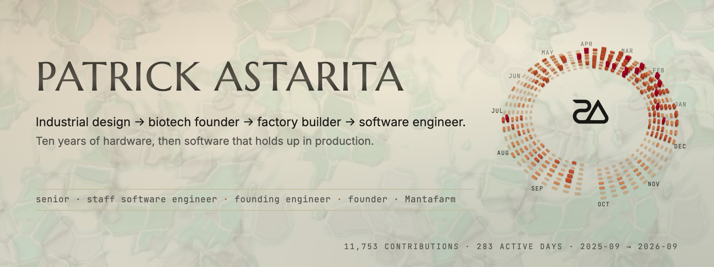
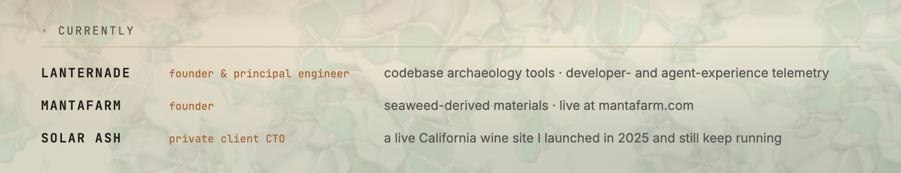
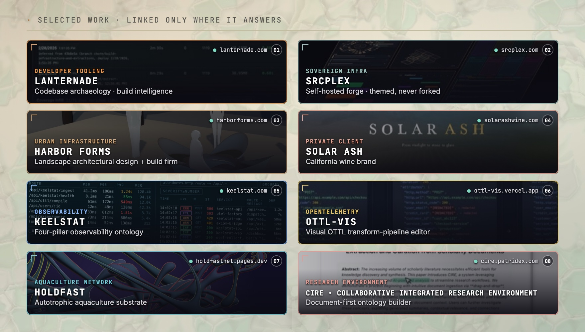
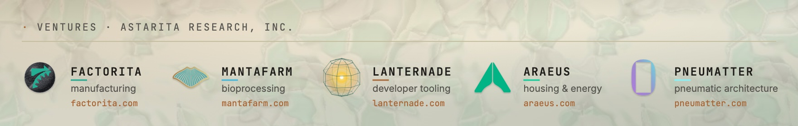
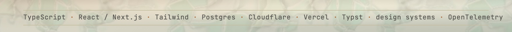

<picture>
  <source media="(prefers-color-scheme: dark)" srcset="./assets/banner-dark.jpg">
  
</picture>

Software design engineer in New York City. I design the interface and then build it.
Senior/staff IC by scope, founding engineer by habit, and a founder — the current company is **Mantafarm**.

Most of what I make is dense: tools for people who already know the domain.

<picture>
  <source media="(prefers-color-scheme: dark)" srcset="./assets/now-dark.jpg">
  
</picture>

**Before that:** ten years of hardware including contract design engineering inside Alphabet on
Google Geo and Project Moonboot, four manufacturing operations built for clients, and a batteries
venture whose seaweed-derived constituents became Mantafarm.

<picture>
  <source media="(prefers-color-scheme: dark)" srcset="./assets/projects-dark.jpg">
  
</picture>

**Things you can open**

- [patrickastarita.com](https://patrickastarita.com) — selected work, with plates
- [lanternade.com](https://lanternade.com) — the product
- [srcplex.com](https://srcplex.com) — the forge
- [harborforms.com](https://harborforms.com) — a landscape design + build firm, lander and gated workspace
- [solarashwine.com](https://solarashwine.com) — a California wine brand, launched 2025 and still running

Most repositories are private client or venture work. Walkthroughs by request.

<picture>
  <source media="(prefers-color-scheme: dark)" srcset="./assets/ventures-dark.jpg">
  
</picture>

<picture>
  <source media="(prefers-color-scheme: dark)" srcset="./assets/stack-dark.jpg">
  
</picture>

<a href="https://patrickastarita.com">patrickastarita.com</a> · <a href="https://www.linkedin.com/in/patrickastarita">linkedin.com/in/patrickastarita</a>
